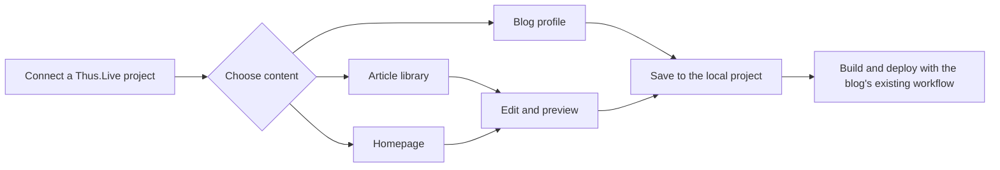

<p align="center">
  
</p>

<p align="center">
  <a href="README.md">简体中文</a> · <strong>English</strong>
</p>

# Thus.Live Editor

**A local desktop writing workspace for Thus.Live blogs.**

Connect an existing blog project, edit posts and the homepage, preview Markdown in real time, and manage the blog profile. Your content stays in your own project directory.

**AI collaboration note: the requirements, design choices, and acceptance decisions for this project were made by a human, with AI (ChatGPT / Codex) assisting with interface design, implementation, testing, and documentation.** This describes the development process and does not add attribution or licensing requirements.

Author: **uMisty** · License: [0BSD](LICENSE) · Stack: Electron / Vue 3 / TypeScript / CodeMirror 6

[Getting started](#getting-started) · [Interface and features](#interface-and-features) · [Local development](#local-development) · [Development and build guide](docs/README.md)

## Interface and features

The screenshots below come from the Windows application running against an isolated sample project. The article content is for demonstration purposes.

### Article library and preview

Single-click an article to preview it on the right. Double-click it, or select **Start writing**, to open the editor. The preview expands with the window, while search and date/tag filters stay at the top of the article list.


### Markdown writing

Choose between writing, split, and preview layouts. The editor provides syntax highlighting, synchronized scrolling, frontmatter editing, image insertion, and local saving. Writing and full-preview modes use all space outside the sidebar.


### Homepage

Edit `content/index.md` directly, switch between body and full-source editing, and preserve metadata such as `layout: home`. Homepage editing includes save conflict checks and recovery copies, and the homepage never appears in the article list.


### Blog profile

Edit the site name, author, homepage title, description, language, URL, avatar, footer, and page size. The values are saved to `site.profile.json` in the current project.


<details>
<summary>View dark mode</summary>

Light, dark, and system-following themes are available under **Project settings → Appearance & writing**.


</details>

### Application settings and updates

Project settings cover project checks, rendering compatibility, appearance, keyboard shortcuts, and an **About** page. The About page displays the installed application version and its matching GitHub Release tag, and it can check for updates manually. The application also checks the latest stable GitHub Release in the background at startup. You can ignore a particular release without disabling notifications for later versions. Updates are never downloaded or installed automatically.

| Area | Capabilities |
| --- | --- |
| Article management | Create drafts, search, filter by date/tag, and quickly open an article |
| Content editing | Markdown body, full source, article metadata, and homepage editing |
| Rendering | Code highlighting, code groups, formulas, Mermaid diagrams, containers, footnotes, and more |
| Image import | Select, drag, or paste images; keep both files or reuse the existing one on a name collision |
| File protection | Save-version comparison, external-change detection, unsaved-change prompts, and recovery copies |
| Article organization | Move or rename, inspect references, save a copy, and use the system trash |
| Version updates | Check the latest stable GitHub Release and ignore notifications per version |

## Getting started

1. Launch the application and choose the **Thus.Live project root**.
2. Review the connection result and enter the writing workspace.
3. Choose **Blog profile**, **Homepage**, **All articles**, or **Drafts** from the sidebar.
4. Select **Save**, or press `Ctrl/⌘ + S`, after making changes.



**Saving does not publish the site.** New articles are drafts and do not participate in the blog build by default. After changing a draft to a published article, you must still build and deploy the blog through its existing workflow.

The project is expected to contain the following files:

```text
Thus.Live/
├── .vitepress/config.ts
├── content/
│   ├── index.md              # Homepage
│   ├── posts/                # Posts: YYYY/MM/DD/slug.md
│   └── public/               # Public site images and other assets
├── src/styles/
│   ├── theme.css
│   └── markdown.css
├── site.config.ts
└── site.profile.json         # Blog profile
```

The connection check primarily reads the article directory, theme styles, and VitePress configuration. A project without a homepage or blog-profile file can still edit articles; the corresponding page will explain which file is missing.

Date and tag filters are selected in a dialog and applied with **View articles**. Closing or canceling the dialog, or pressing `Esc`, preserves the previous filter.

### Keyboard shortcuts

| Action | Windows / Linux | macOS |
| --- | --- | --- |
| Save the current content | `Ctrl + S` | `⌘ + S` |
| Quickly open an article | `Ctrl + P` | `⌘ + P` |
| Create an article | `Ctrl + N` | `⌘ + N` |
| Find in the editor | `Ctrl + F` | `⌘ + F` |
| Close a dialog | `Esc` | `Esc` |

## Downloads and releases

Official packages are available from [GitHub Releases](https://github.com/uMisty/LiveEditor/releases). Windows builds include an NSIS installer and ZIP archive, macOS builds include DMG and ZIP packages, and Linux builds include AppImage and DEB packages. Running the `Desktop builds` workflow manually tests and creates reusable packages on all three operating systems. The `Publish desktop release` workflow selects a successful build, verifies its source and version, and publishes it without rebuilding. Every Release includes a `SHA256SUMS.txt` checksum file.

Before publishing, add the matching release notes under [`docs/releases`](docs/releases/README.md), then run `Desktop builds` from GitHub Actions. After it succeeds, copy the run ID from the address bar and run `Publish desktop release` with that `run_id` and a tag matching `package.json`. The workflow reads `docs/releases/vX.Y.Z.md` by default; a manually entered `release_notes` value overrides the archive. `generate_notes` controls whether GitHub's generated change list is appended. Ordinary pushes do not start desktop builds or create a GitHub Release.

The project is applying to the SignPath Foundation open-source code-signing program. After approval and integration, Windows packages will use “Free code signing provided by SignPath.io, certificate by SignPath Foundation.” Until then, each Release identifies Windows files as unsigned. See the [code-signing policy](CODE_SIGNING_POLICY.md).

## Local development

The project currently uses **Node.js 24 and pnpm 11**. From the repository root, run:

```sh
pnpm install
pnpm dev
```

Electron may need to be downloaded on the first run. The development server starts at port `5186` and tries the next available port when necessary. Closing the application stops that development server.

| Command | Purpose |
| --- | --- |
| `pnpm test` | Test project I/O, rendering, and version comparison |
| `pnpm build` | Type-check and build the renderer and Electron processes |
| `pnpm test:e2e` | Run integration tests in a real Electron window after building |
| `pnpm start` | Run the previously built application |
| `pnpm package` | Create an unpacked application directory |
| `pnpm dist` | Create the current platform's installer and archive packages |
| `pnpm icons` | Regenerate platform icons from the SVG source |
| `pnpm docs:screenshots` | Refresh README screenshots using a temporary sample project after building |

Build output is written to `release/`. Keep the complete directory when using the unpacked Windows build. Three-platform CI runs core tests, the production build, and Electron integration tests. Platform signing, notarization, and broader Linux distribution compatibility still require release-stage verification. See the [development and build guide](docs/README.md) for details.

## Preview behavior and compatibility

The editor uses the project's `theme.css` and `markdown.css`, with a built-in VitePress renderer adapter matching the current Thus.Live configuration. Markdown is compiled in a separate process, sanitized, and displayed in a sandbox without file-write access.

- Supports Shiki light/dark themes, line numbers, highlighting, diff/focus markers, code groups, MathJax, Mermaid, containers, Details, footnotes, task lists, and other extensions.
- Project configuration is inspected statically and never executed; custom Vue components must be checked on the built blog.
- `<<<` external snippets and `@include` directives are not expanded; only YAML frontmatter is parsed.
- The preview does not load remote images. Local images are resolved near the article or under `content/public`.
- Moving an article updates only recognizable Markdown links. Dynamic references and redirects for already published URLs require manual review.
- Markdown compilation is limited to 5 MB, and a single imported image is limited to 25 MB.
- At startup, the application requests this repository's latest stable GitHub Release for version comparison. It does not upload articles, images, project paths, or blog configuration, and it never downloads or installs packages automatically.

Windows has been verified locally. Three-platform CI handles automated builds and integration tests on each operating system. macOS signing and notarization, Windows code signing, and different Linux desktop environments still require separate verification.

## Documentation and design

- [Development, builds, data protection, and troubleshooting](docs/README.md)
- [Code-signing policy](CODE_SIGNING_POLICY.md)
- [Privacy policy](PRIVACY.md)
- [Release-notes archive and publishing process](docs/releases/README.md)
- [Screenshot sources and refresh instructions](docs/images/README.md)
- [Application icon design](design/APP-ICON.md)
- [Figma implementation audit](design/FIGMA-IMPLEMENTATION-AUDIT.md)
- [Figma design file](https://www.figma.com/design/GBJVh0iLtAnjrq4pye75YS)

## Author and license

Author: **uMisty**.

This project is licensed under the [BSD Zero Clause License (0BSD)](LICENSE). The standard text is also available from [SPDX](https://spdx.org/licenses/0BSD.html). Third-party dependencies and fonts retain their respective licenses; see the [third-party notices](THIRD_PARTY_NOTICES.md).
