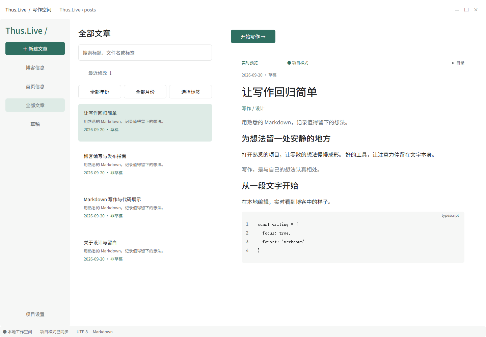
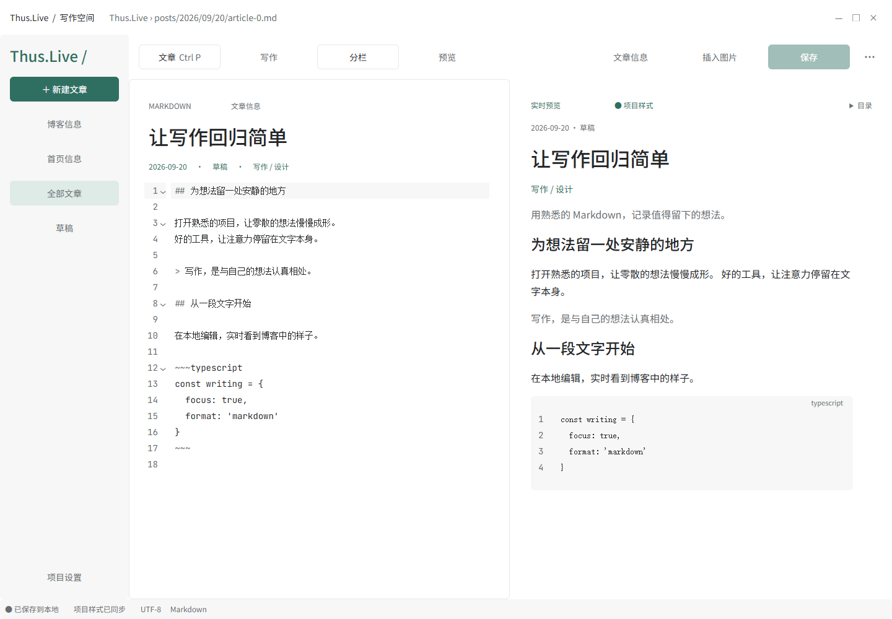
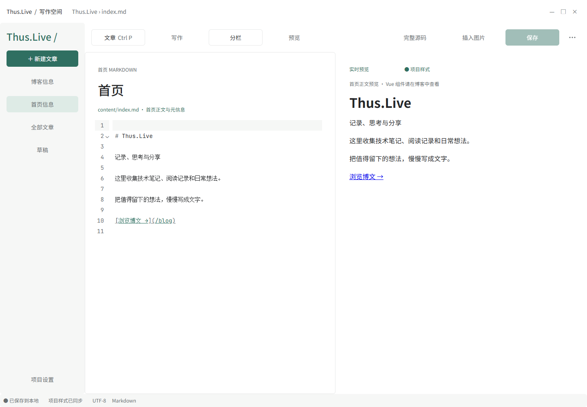
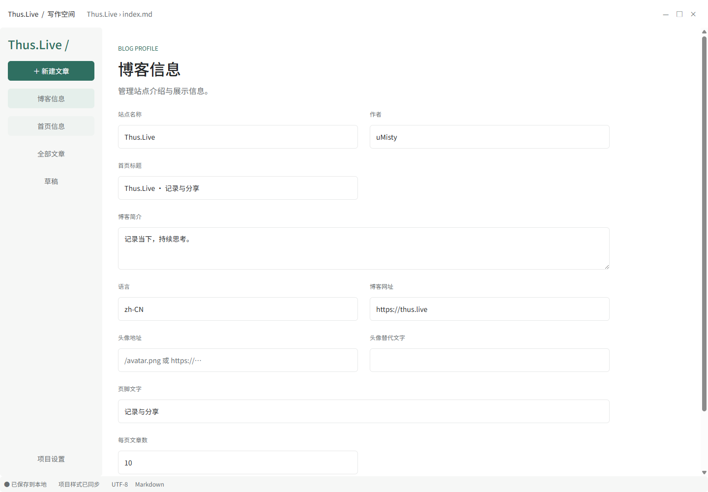
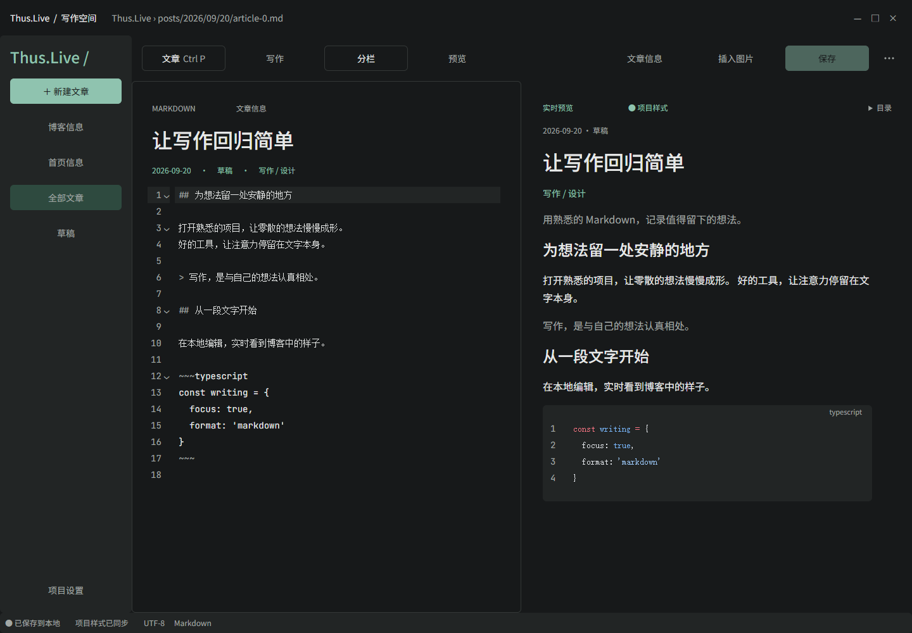
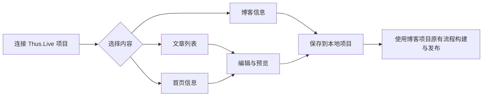

<p align="center">
  
</p>

# Thus.Live Editor

**为 Thus.Live 博客准备的本地桌面写作空间。**

连接已有博客项目，编辑文章和首页，实时预览 Markdown，并管理博客信息。内容保存在自己的项目目录中。

**AI 协作说明：本项目由人类提出需求、选择设计并验收，AI（ChatGPT / Codex）协助完成界面设计、代码实现、测试与文档。** 这是开发方式说明，不构成额外的署名或使用条件。

作者：**uMisty** · 许可证：[0BSD](LICENSE) · 技术栈：Electron / Vue 3 / TypeScript / CodeMirror 6

[开始使用](#开始使用) · [界面与功能](#界面与功能) · [本地开发](#本地开发) · [开发与构建指南](docs/README.md)

## 界面与功能

截图来自实际运行的 Windows 应用，使用隔离的示例项目；文章内容用于演示。

### 文章列表与预览

单击文章即可在右侧预览，双击或点击“开始写作”进入编辑。预览区域随窗口伸展；搜索、日期和标签筛选集中在列表顶部。



### Markdown 写作

支持写作、分栏和预览三种布局，提供语法高亮、同步滚动、元信息编辑、图片插入及本地保存。写作和完整预览模式使用侧栏外的剩余宽度。



### 首页信息

直接编辑 `content/index.md`，在正文与完整源码之间切换，保留 `layout: home` 等元信息。首页支持保存、冲突检测和恢复副本，不会混入文章列表。



### 博客信息

编辑站点名称、作者、首页标题、简介、语言、网址、头像、页脚和每页文章数，保存到当前项目的 `site.profile.json`。



<details>
<summary>查看深色模式</summary>

支持浅色、深色以及跟随系统；在“项目设置 → 外观与写作”中切换。



</details>

| 功能 | 使用方式 |
| --- | --- |
| 文章管理 | 新建草稿、搜索、日期/标签筛选、快速打开 |
| 内容编辑 | Markdown 正文、完整源码、文章元信息、首页编辑 |
| 渲染预览 | 代码高亮、代码组、公式、Mermaid 图表、提示块、脚注等 |
| 图片导入 | 选择、拖入或粘贴图片；同名时确认保留两份或使用现有图片 |
| 文件保护 | 保存版本比对、外部修改提示、未保存提醒、恢复副本 |
| 文章整理 | 移动或重命名、检查引用、另存副本、系统回收站 |

## 开始使用

1. 启动应用，选择 **Thus.Live 项目根目录**。
2. 检查连接结果，进入写作空间。
3. 从侧栏选择“博客信息”“首页信息”“全部文章”或“草稿”。
4. 修改后点击“保存”或按 `Ctrl/⌘ + S`。



**保存不会自动发布。** 草稿默认不参与博客构建；设为非草稿后仍需按博客项目的流程构建和部署。

项目应包含以下文件：

```text
Thus.Live/
├── .vitepress/config.ts
├── content/
│   ├── index.md              # 首页
│   ├── posts/                # 博文：YYYY/MM/DD/slug.md
│   └── public/               # 站内公共图片等资源
├── src/styles/
│   ├── theme.css
│   └── markdown.css
├── site.config.ts
└── site.profile.json         # 博客信息配置
```

连接检查主要读取文章目录、主题样式和 VitePress 配置。缺少首页或博客配置文件的项目仍可编辑文章，相应页面会提示文件缺失。

日期和标签在弹窗内选择，点击“查看文章”后应用；关闭、取消或按 `Esc` 会保留原有筛选。

### 快捷键

| 操作 | Windows / Linux | macOS |
| --- | --- | --- |
| 保存当前内容 | `Ctrl + S` | `⌘ + S` |
| 快速打开文章 | `Ctrl + P` | `⌘ + P` |
| 新建文章 | `Ctrl + N` | `⌘ + N` |
| 编辑器内查找 | `Ctrl + F` | `⌘ + F` |
| 关闭弹窗 | `Esc` | `Esc` |

## 下载与发布

正式安装包从 [GitHub Releases](https://github.com/uMisty/LiveEditor/releases) 下载。手动运行 `Desktop builds` 工作流可生成可复用的三平台安装包；`Publish desktop release` 工作流仅在手动触发时选择某次成功构建、校验来源与版本并发布，不会重复编译。每个 Release 都附带 `SHA256SUMS.txt` 校验清单。

发布时先在 Actions 中手动运行 `Desktop builds`，成功后从地址栏复制运行编号；再手动运行 `Publish desktop release`，填写该 `run_id`、与 `package.json` 一致的版本标签，以及可选的 Markdown Release notes。`generate_notes` 控制是否在手写说明之后附加 GitHub 自动生成的变更记录。普通推送不会启动桌面构建，也不会创建 GitHub Release。

项目正在申请 SignPath Foundation 的开源代码签名服务。申请获批并完成集成后，Windows 发布文件将使用“Free code signing provided by SignPath.io, certificate by SignPath Foundation”。在此之前，Release 说明会明确标记 Windows 文件尚未签名，详见[代码签名政策](CODE_SIGNING_POLICY.md)。

## 本地开发

当前项目使用 **Node.js 24 与 pnpm 11**。在项目根目录运行：

```sh
pnpm install
pnpm dev
```

首次启动可能需要下载 Electron。开发服务默认使用 `5186`；已被占用时会尝试下一个可用端口。退出应用会停止该次开发服务。

| 命令 | 作用 |
| --- | --- |
| `pnpm test` | 项目读写及渲染测试 |
| `pnpm build` | 类型检查、前端及 Electron 构建 |
| `pnpm test:e2e` | 真实 Electron 窗口集成测试，先执行构建 |
| `pnpm start` | 运行已构建的应用 |
| `pnpm package` | 生成可运行的应用目录 |
| `pnpm dist` | 生成当前系统的安装包与压缩包 |
| `pnpm icons` | 从 SVG 母版重新生成各平台图标 |
| `pnpm docs:screenshots` | 用临时示例项目更新本文截图，先执行构建 |

构建产物位于 `release/`。Windows 支持 NSIS 安装包和 ZIP；运行解压版时保留完整目录。macOS 配置 DMG/ZIP，Linux 配置 AppImage/DEB，需要在对应系统构建和验证。详细流程见[开发与构建指南](docs/README.md)。

## 预览与兼容范围

编辑器沿用项目的 `theme.css` 与 `markdown.css`，内置与当前 Thus.Live 配置匹配的 VitePress 渲染适配器。Markdown 在独立进程编译，净化后在沙箱中展示，预览页面没有文件写入权限。

- 支持 Shiki 双主题、行号、高亮、diff/focus、代码组、MathJax、Mermaid、提示容器、Details、脚注、任务列表等语法。
- 项目配置只作静态检查，不执行其中的脚本；自定义 Vue 组件需要在博客站点查看。
- 不展开 `<<<` 外部代码片段和 `@include`；只解析 YAML 元信息。
- 预览不加载远程图片；本地图片来自文章附近或 `content/public`。
- 移动时仅自动更新可识别的 Markdown 链接；动态引用及线上地址重定向需另行处理。
- Markdown 编译上限为 5 MB，单张导入图片上限为 25 MB。

Windows 已在本机验证；macOS/Linux 的构建配置和 CI 工作流已提供，尚需对应系统实测。

## 文档与设计

- [开发、构建、数据保护与故障排查](docs/README.md)
- [代码签名政策](CODE_SIGNING_POLICY.md)
- [隐私政策](PRIVACY.md)
- [截图来源及更新方法](docs/images/README.md)
- [应用图标设计](design/APP-ICON.md)
- [Figma 实现核对记录](design/FIGMA-IMPLEMENTATION-AUDIT.md)
- [Figma 设计文件](https://www.figma.com/design/GBJVh0iLtAnjrq4pye75YS)

## 作者与许可证

作者：**uMisty**。

本项目采用 [BSD Zero Clause License（0BSD）](LICENSE)，标准文本参见 [SPDX](https://spdx.org/licenses/0BSD.html)。第三方依赖与字体沿用各自许可证，见[第三方资源说明](THIRD_PARTY_NOTICES.md)。
