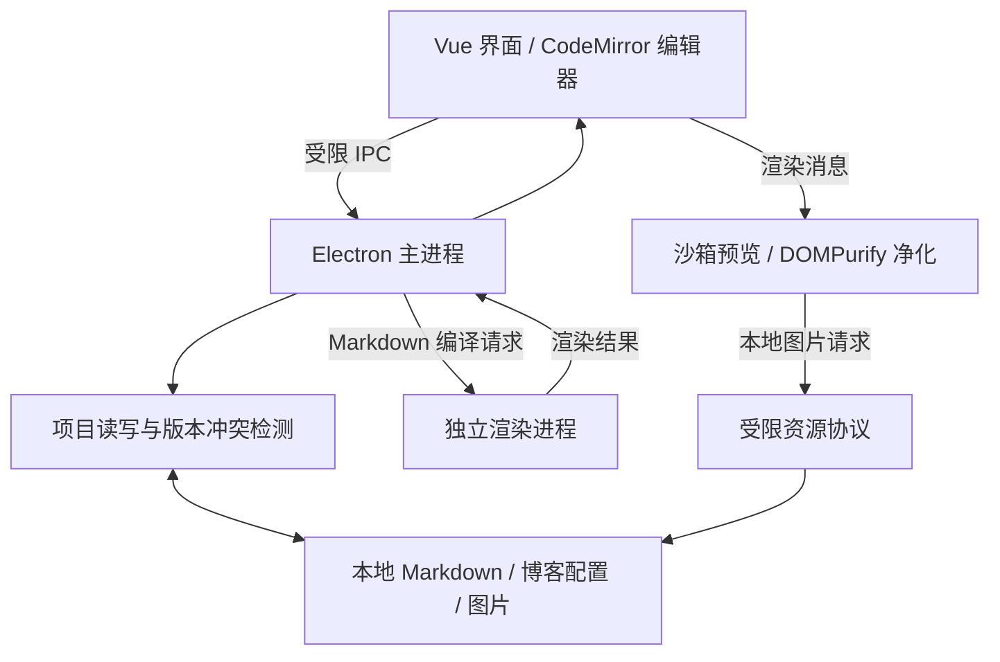

# 开发与维护指南

[返回项目首页](../README.md)

## 应用结构



预览仅展示内容，保存动作由主进程处理。连接项目不会执行博客配置脚本，也不会自动构建或发布站点。

| 目录 | 内容 |
| --- | --- |
| `src/` | Vue 界面、编辑器、预览与样式 |
| `electron/` | 桌面窗口、IPC、项目读写与渲染进程 |
| `shared/` | 类型、元信息处理和博客配置定义 |
| `public/` | 应用图标、本地字体及字体许可证 |
| `scripts/` | 开发启动、构建、图标生成、文档截图 |
| `tests/` | 单元测试和 Electron 集成测试 |
| `docs/`、`design/` | 文档截图、设计说明与核对记录 |
| `dist/`、`dist-electron/` | 构建生成目录 |
| `release/` | 应用目录、安装包和便携压缩包 |

## 开发环境

使用 Node.js 24、pnpm 11；CI 使用相同的主要版本。依赖安装脚本允许列表位于 `pnpm-workspace.yaml`。

```sh
pnpm install
pnpm dev
```

在 Windows 上，建议在 PowerShell 中开发并运行 Windows Electron。WSL 中运行的是 Linux 桌面应用，需要可用的图形环境；不要在 Windows 与 WSL 之间复用同一份 `node_modules`。

开发启动脚本会构建主进程并启动 Vite。仅界面修改通常可热更新；主进程、预加载脚本或 IPC 修改后，退出应用并重新运行 `pnpm dev`。

## 验证和构建

```sh
pnpm test
pnpm build
pnpm test:e2e
```

测试使用临时博客和独立应用配置目录，覆盖 Markdown 渲染、文件冲突、图片重名、博客配置、首页编辑、筛选弹窗以及窗口交互。文章列表与编辑预览同时覆盖开发模式和构建模式。

Windows 打包示例：

```sh
pnpm build
pnpm exec electron-builder --win nsis zip --publish never
```

默认输出示例：

```text
release/
├── win-unpacked/Thus.Live Editor.exe
├── Thus.Live Editor Setup 0.1.0.exe
└── Thus.Live Editor-0.1.0-win.zip
```

`win-unpacked` 和便携版需保留全部文件，不能单独搬走 EXE。`pnpm package` 生成当前平台的可运行目录；`pnpm dist` 使用当前平台的安装包目标。已有安装包不会随源码变更自动更新，需要重新打包。

[三平台 CI 工作流](../.github/workflows/build.yml)负责安装、测试、构建和上传应用目录；配置文件存在不代表远程工作流已经执行。发行签名和 macOS 公证由发行者配置。

每次发布前在 [`docs/releases`](releases/README.md) 新增 `vX.Y.Z.md`。发布工作流在未填写临时说明时会自动读取这个归档文件，并另外附加构建来源、签名状态以及可选的 GitHub 自动变更列表。

## 数据与保存

| 内容 | 位置 | 写入时机 |
| --- | --- | --- |
| 博文 | `content/posts/YYYY/MM/DD/slug.md` | 新建或明确保存时 |
| 首页 | `content/index.md` | 明确保存时 |
| 博客信息 | `site.profile.json` | 点击保存或使用保存快捷键 |
| 导入图片 | 当前文档附近的 `assets/` | 确认复制并插入时 |
| 偏好、恢复副本 | Electron 用户数据目录 | 按应用逻辑保存 |

保存前比对文件版本，检测到外部修改时避免直接覆盖。图片同名时可保留两份或引用现有图片。移动文章会检查目标路径和已识别引用；删除文章使用系统回收站，首页不提供移动和删除操作。

| 环境变量 | 作用 |
| --- | --- |
| `THUS_READ_ONLY=1` | 禁止向已连接项目写入 |
| `THUS_USER_DATA` | 指定应用偏好及恢复副本目录 |
| `THUS_REFERENCE_ROOT` | 集成测试读取参考项目的样式与图标 |

PowerShell 示例：

```powershell
$env:THUS_READ_ONLY = '1'
$env:THUS_USER_DATA = Join-Path $env:TEMP 'thus-editor-review'
pnpm dev
```

改变用户数据目录会切换偏好与恢复副本所在位置；不会迁移旧目录的内容。

## 图标与截图

图标母版为 [`public/app-icon.svg`](../public/app-icon.svg)。修改后运行 `pnpm icons`，生成 PNG、ICO 和 ICNS，再重新构建应用，详见[图标设计说明](../design/APP-ICON.md)。

```sh
pnpm build
pnpm docs:screenshots
```

截图脚本启动实际 Electron 应用，在临时项目中生成示例数据，输出至 [`docs/images`](images/README.md)，完成后退出并清理临时数据，不修改用户博客。

## 常见问题

**预览空白**：确认使用最新代码并重启 `pnpm dev`。开发预览沙箱使用独立来源，Vite 配置已允许其加载本地模块。构建模式请先运行 `pnpm build`。

**端口占用**：开发脚本会自动尝试其他端口，以终端显示的地址为准；需要重新启动时先退出旧开发实例。

**首页或博客配置打不开**：确认项目包含 `content/index.md` 和 `site.profile.json`；编辑器不会用空文件覆盖已有结构。

**筛选结果没有变化**：在弹窗中点击“查看文章”才应用。取消、关闭或 `Esc` 会保留原条件；“清除筛选”恢复全部条件。

**预览与线上略有差异**：编辑器适配已检查的 Markdown 扩展，不执行任意 Vue 组件、动态配置或外部文件引入。线上结果仍以博客构建为准。

## 许可证

项目代码采用 [0BSD](../LICENSE)，作者 **uMisty**。字体与第三方软件保留各自的许可，见[第三方资源说明](../THIRD_PARTY_NOTICES.md)。
